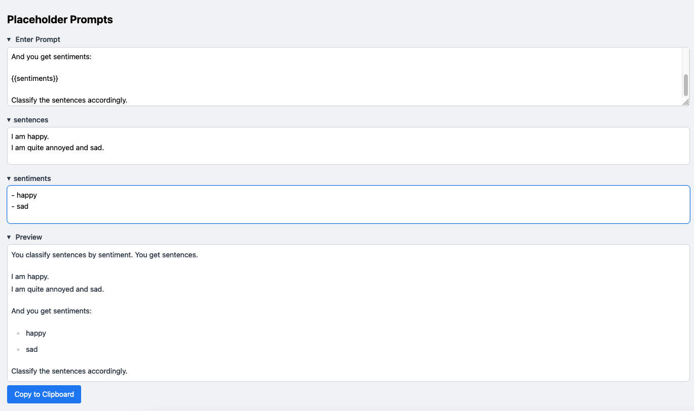

# Placeholder Prompts

Construct LLM prompts with placeholders.  
Add placeholders in brackets.  
e.g. `{{examples}}`.  
Edit placeholders separatedly.  
See a combined preview.  
Copy to clipboard.

**Example**

```
You classify sentences by sentiment.
You get sentences.

{{sentences}}

And you get sentiments:

{{sentiments}}

Classify the sentences accordingly.
```

**Screenshot**


